# Anima

A habit tracker where consistency builds a living creature. Each completed habit feeds stat points (Strength, Intellect, Spirit) to a pet that evolves at 100 XP and 500 XP, with nine possible final forms. Miss a day and the pet loses 10% HP.

[](https://github.com/parthiv-2006/Anima/actions/workflows/ci.yml)
[](https://anima-client.vercel.app)
[](LICENSE)

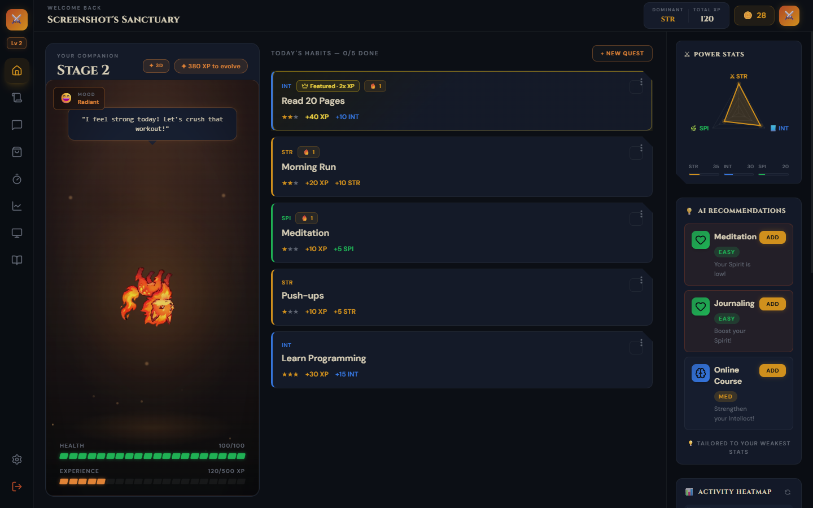

---

## What It Is

Most habit trackers give you a streak counter. Anima gives you stakes. Every completed habit awards stat points across three categories that shape which of nine evolution paths your creature follows. The final form depends on your dominant stat and whether your build is pure (dominant stat at least 2x the lowest) or hybrid. A missed day deducts HP without freeze protection. The evolution formula runs on every XP change, including undos, so reverting a habit can push the creature back a stage.

---

## Try It

[](https://anima-client.vercel.app)

---

## Screenshots

### Auth

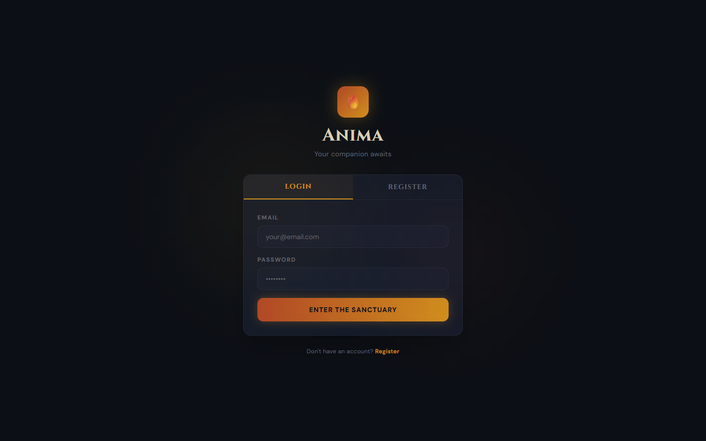 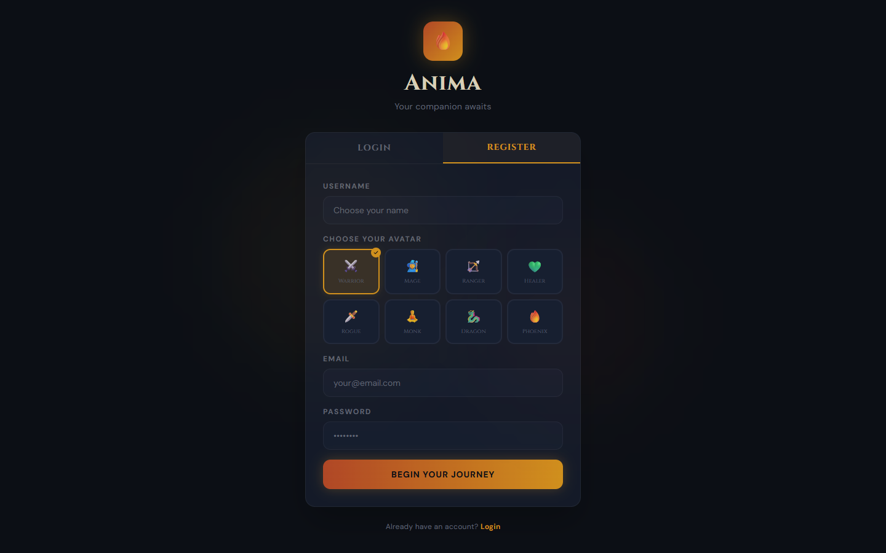

Registration lets you pick one of eight species. The choice determines which evolution branch your creature follows. JWT auth with a 7-day token; bcrypt cost factor 10.

### Dashboard


Three panels: a 60px icon sidebar with a level badge (`floor(totalXp / 100) + 1`), a habitat panel with the animated pet and HP/XP bars, and a quest list grouped by completion status. The sidebar also surfaces AI-generated habit recommendations ranked by your two weakest stats (no LLM dependency, purely rule-based).

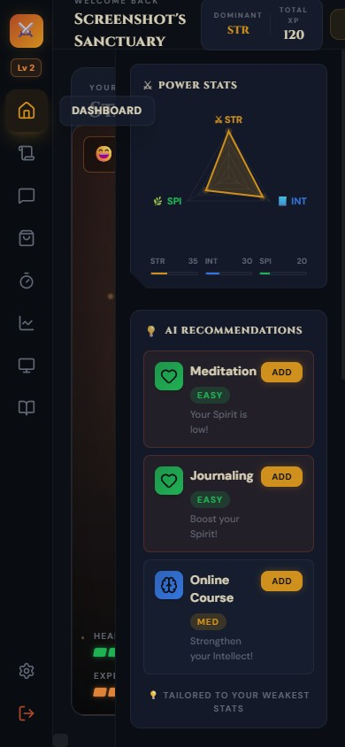

On mobile the sidebar collapses to icon-only. The power stats radar and AI recommendations stack vertically below the pet habitat.

### Quests

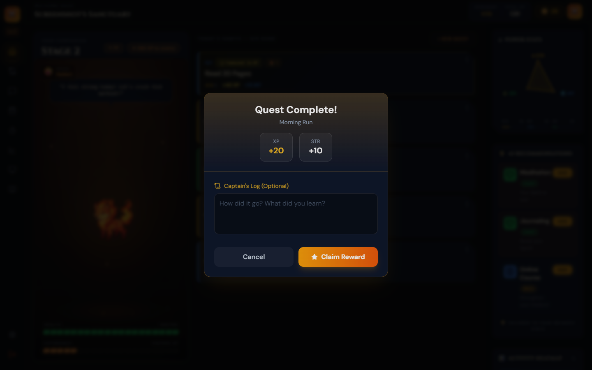 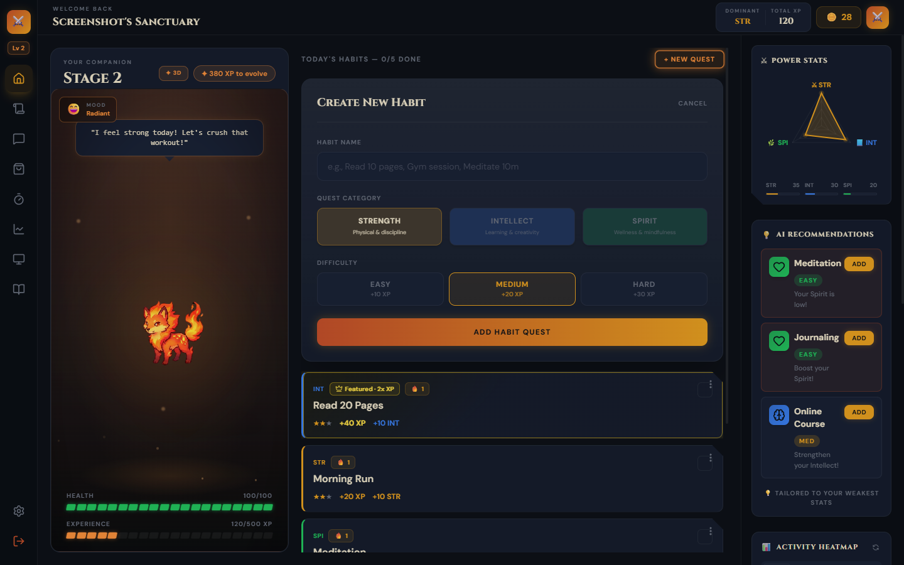

Completing a quest opens a modal showing the exact XP and stat reward before confirming. Creating a quest assigns a category (STR / INT / SPI) and difficulty (Easy / Medium / Hard), which determines how many XP and coins it awards and how fast it builds the chosen stat.

### Pet Companion Chat

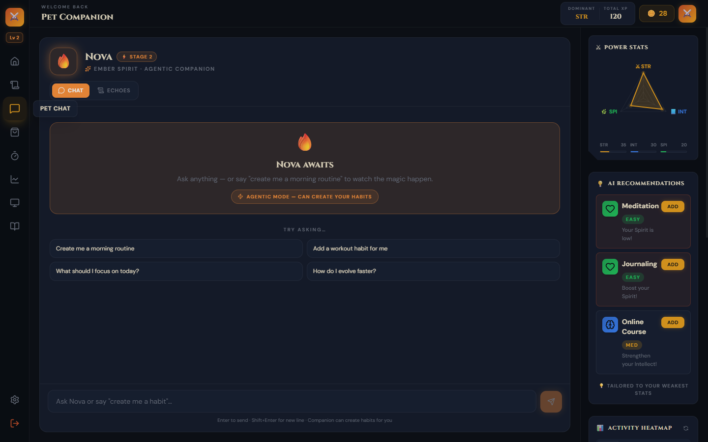

Each species has a distinct personality injected via system prompt: Ember is a fiery mentor, Aqua is a calm sage, Terra is a grounded nurturer. Current stat values and total XP are included in every Groq call so the pet can comment on your actual progress.

### Adventure Log

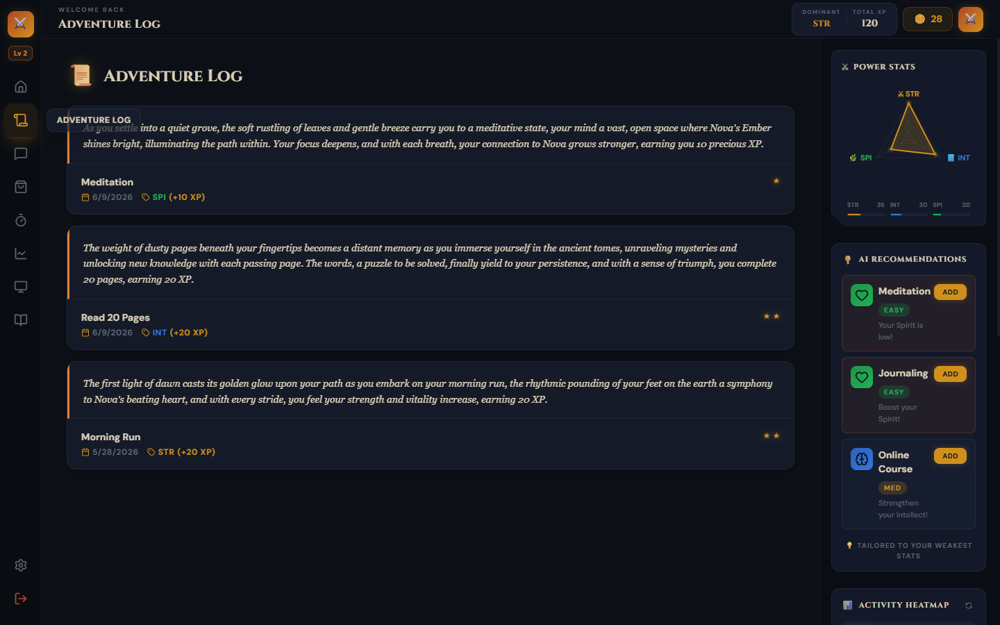

The adventure log is a flat chronological list of all quest completions across every habit. Groq `llama-3.1-8b-instant` generates a 2-sentence RPG paragraph per entry when the log opens. Narratives are held in React component state and regenerated on each mount.

### Shop

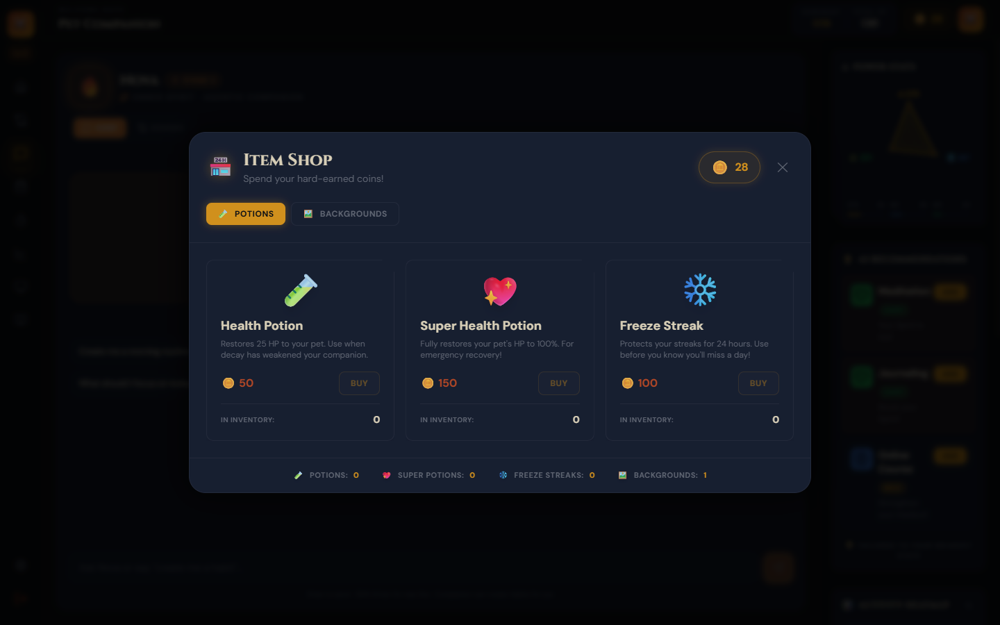 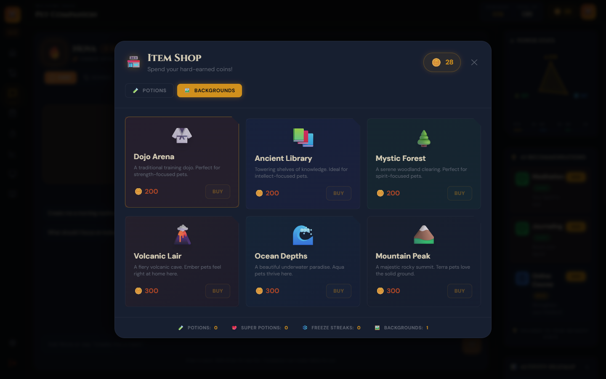

Coins earned per completion (`5 * difficulty + min(streak, 7)`) buy health potions, freeze streak tokens, or themed environment backgrounds (Dojo Arena, Ancient Library, Mystic Forest, Volcanic Lair, Ocean Depths, Mountain Peak). Backgrounds render as gradient overlays in the habitat panel and persist to the User's embedded `inventory` subdocument.

### Focus Timer

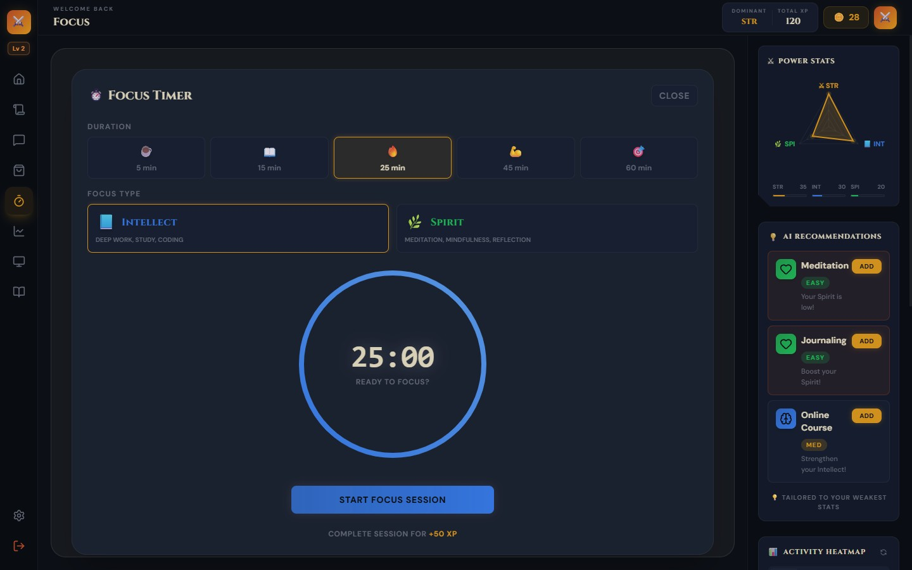

A Pomodoro countdown that routes XP through the same `calculateEvolution()` pipeline as regular habits. On completion the client creates a temporary habit, completes it, then deletes it; a timer session can trigger an evolution. Difficulty scales as `ceil(duration / 20)` capped at 3. State (`targetEndTime`, `selectedStat`, `isPaused`) persists to `localStorage` so a refresh mid-session doesn't lose the countdown.

### Insights

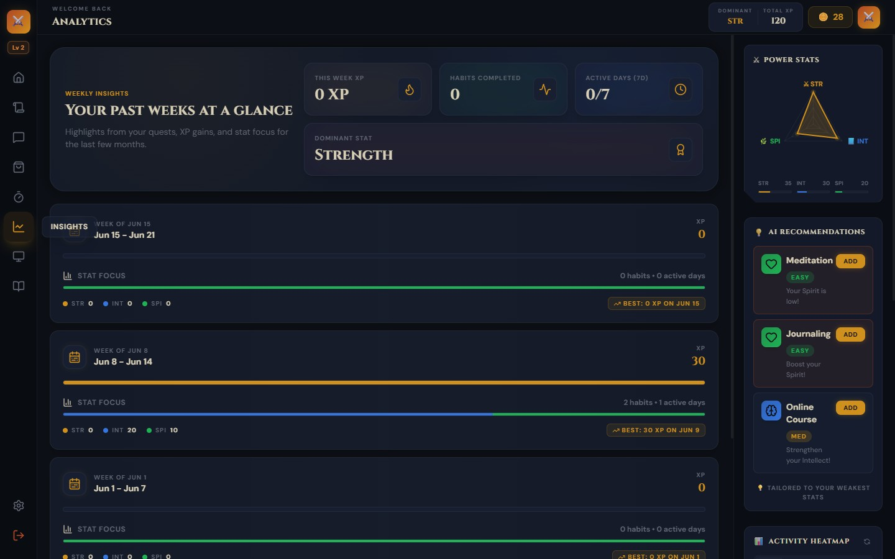

Per-day XP aggregation computed server-side from account creation date. The weekly bar chart breaks totals down by stat category (STR, INT, SPI). The heatmap covers every day since registration, useful for spotting consistency gaps before HP starts draining.

### Evolution Guide

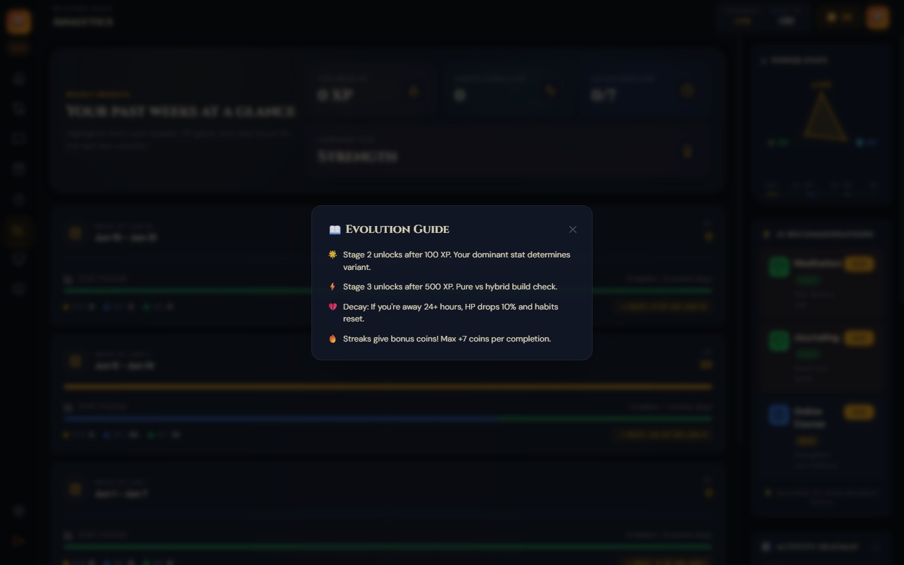

The guide overlay maps all nine evolution paths: three species (Ember, Aqua, Terra) each with three stat branches (STR, INT, SPI), with a pure and hybrid fork at Stage 3. A pure build requires the dominant stat to be at least 2x the minimum. `calculateEvolution()` re-evaluates this on every XP mutation including undos.

### Ambient Mode

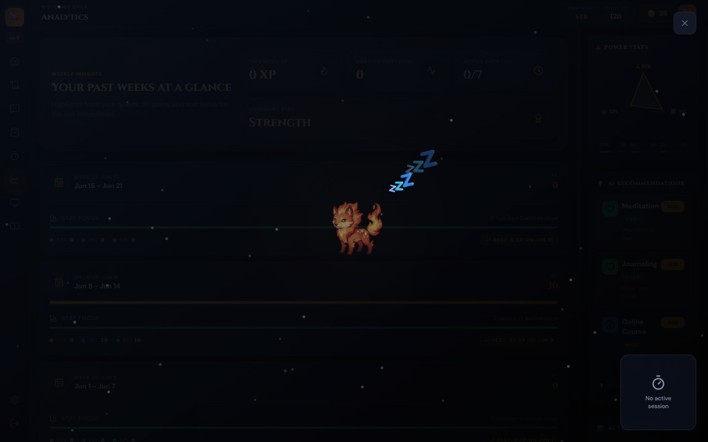

A distraction-free full-screen view of the pet. Wellness reminder thought bubbles appear after 30 seconds, then recur every 20 to 40 minutes on a randomized delay to reduce habituation.

### Settings

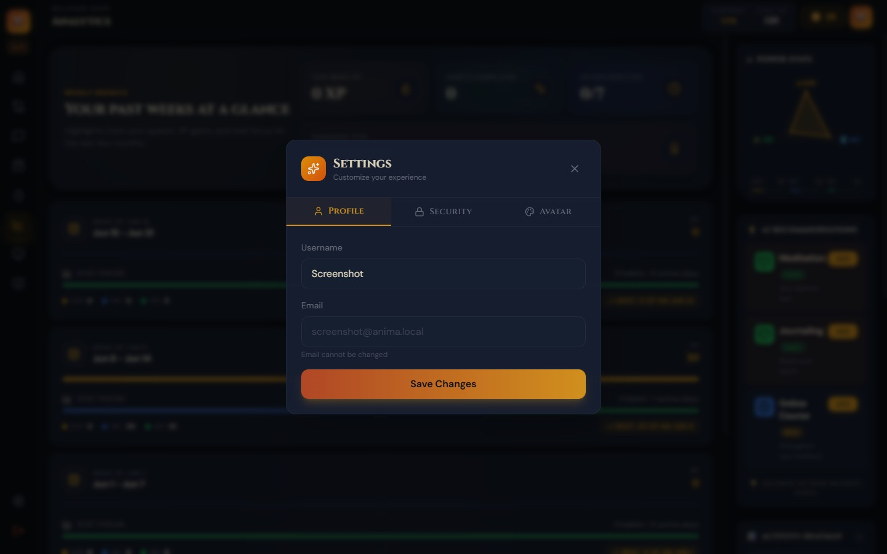

Settings covers profile updates (username, avatar) and password changes. Password update calls `PUT /api/auth/update-password` with bcrypt rehashing at cost factor 10.

---

## Features

- **Nine evolution paths**: across three species (Ember, Aqua, Terra) and three stat branches; stage 3 forks into pure (dominant stat at least 2x the minimum) or hybrid, computed by `calculateEvolution()` on every XP mutation including undos
- **Quest cards with optimistic UI**: the card flips to completed before the API response returns, then reverts on failure; `canvas-confetti` is dynamically imported so the 14 KB library stays out of the initial bundle
- **HP decay**: `POST /api/pet/decay` deducts 10% HP and resets `isCompletedToday` on all habits when more than 24 hours have passed since last login
- **Daily streak middleware**: `dailyReset` checks UTC calendar date boundaries, not 24-hour elapsed time; a user who logs in at 23:55 and again at 00:05 triggers a reset; freeze protection overrides streak breaks and is consumed after one use
- **Focus timer with XP routing**: Pomodoro countdown persists `targetEndTime`, `selectedStat`, and `isPaused` to `localStorage`; on completion, creates and deletes a temporary habit to route XP through `calculateEvolution()`
- **Item shop**: three consumable types (health potion, super health potion, freeze streak) and six purchasable backgrounds stored in an embedded `Inventory` subdocument on the User model
- **Adventure log**: flat aggregation of all `completionLog` entries across habits, sorted newest-first; Groq `llama-3.1-8b-instant` generates a 2-sentence RPG paragraph per entry on log open
- **Productivity heatmap and weekly insights**: per-day XP aggregation computed server-side from account creation date; weekly bar charts break down by stat category
- **AI pet companion chat**: species-specific personality (Ember: fiery mentor, Aqua: calm sage, Terra: grounded nurturer) with live stat context injected into each Groq prompt; session history maintains multi-turn coherence
- **Rule-based habit recommendations**: identifies the two weakest stats and returns prioritized suggestions; no LLM dependency
- **Ambient mode**: full-screen pet view with staggered wellness thought bubbles on a randomized 20 to 40 minute interval

---

## Tech Stack

| Layer | Technology | Notes |
|-------|-----------|-------|
| Frontend | React 18 + Vite 5 | Pure SPA; per-chunk dynamic imports keep the initial bundle tight |
| Styling | Tailwind CSS 3 | Custom design token set: 8 semantic color tokens, 4 glow box-shadows in `tailwind.config.js` |
| UI animation | Framer Motion 11 | `AnimatePresence` for mount/unmount transitions; spring physics for evolution modal and nav states |
| Pet animation | Framer Motion 11 | Weighted idle cycle across 5 states (idle 40%, bounce 20%, sleep 15%, wiggle 15%, float 10%) |
| Evolution cinematics | lottie-react 2 | Bundled Lottie JSON for Ember species; static PNGs for Aqua and Terra stages 2 and 3 |
| State | Zustand 4 + persist | Auth token and user object survive page refreshes; `isHydrated` flag prevents flash of unauthenticated UI |
| Particle effects | canvas-confetti 1.9 | Dynamically imported on first quest completion; per-stat color palettes (STR=amber, INT=blue, SPI=green) |
| Charts | Recharts 2 | Declarative SVG radar chart for the stat triangle; bar charts for weekly breakdown |
| Backend | Express 4 + Node.js | Four route groups: auth, pet, habits, shop |
| ODM | Mongoose 8 | Embedded subdocuments for Pet, Habits, and Inventory eliminate join queries |
| Auth | JWT (jsonwebtoken 9) + bcryptjs 2 | Stateless 7-day tokens; bcrypt cost factor 10 |
| Security | helmet 8, express-rate-limit 8, express-mongo-sanitize 2, xss-clean 0.1 | 100 req/15 min general limit; 10 req/hour on auth endpoints per IP |

---

## Architecture

```
Browser (React 18 SPA, Vite 5)
  Zustand stores (auth, pet) -- persisted to localStorage
  Framer Motion + lottie-react
  fetchWithAuth() -- Bearer token from localStorage
        |
        | HTTP / REST (JSON)
        v
Express 4 API (Node.js)
  helmet / rate-limit / mongoSanitize / xss-clean
  POST /api/auth/register|login
  PUT  /api/auth/update-password
  GET|POST /api/pet
  GET|POST|DELETE /api/habits  (+ dailyReset middleware)
  GET|POST /api/shop
  calculateEvolution(pet) -- called on every XP mutation
        |
        | Mongoose ODM
        v
MongoDB (single collection: users)
  user
    pet             embedded subdocument
    habits[]        array of embedded subdocuments
      completionLog[]  per-habit audit trail
    inventory       embedded subdocument
```

All game state lives in a single MongoDB document per user. The most common read, loading the dashboard, fetches everything in one `User.findById` call. The tradeoff: the habits array is unbounded, so at scale a dedicated Habits collection with a `userId` index would be necessary once `completionLog` arrays push documents toward MongoDB's 16 MB document ceiling.

---

## How It Works

1. **Registration**: creates a User document with the chosen species, initializes `pet.stats` to `{str: 10, int: 10, spi: 10}`, sets `totalXp: 0` and `stage: 1`, hashes the password with bcrypt (cost 10), and returns a 7-day JWT.

2. **Daily reset**: every request to `/api/habits` passes through `dailyReset`. If the current UTC calendar date is later than `lastLogin`'s date, habits not completed the previous day lose their streak. If `freezeProtectionUntil > Date.now()`, only `isCompletedToday` resets, streaks are preserved, and the token is consumed.

3. **Quest completion**: `POST /api/habits/:id/complete` awards `10 * difficulty` XP to `pet.totalXp` and `5 * difficulty` points to the habit's stat key, then calls `calculateEvolution(pet)`. If `totalXp >= 500`, the function checks whether the dominant stat is at least 2x the minimum; a pure build produces `SPECIES_STAT_PURE`, a balanced build produces `SPECIES_HYBRID`. Coins are awarded as `5 * difficulty + Math.min(streak, 7)`.

4. **Evolution cinematics**: the React client detects a stage transition by comparing `response.pet.totalXp` to the stage threshold against the current `pet.stage` in Zustand. `EvolutionEvent` runs three phases: intro (mount), charge at 900 ms (grayscale pulse, expanding amber rings), and transform at 2200 ms (new form scales in with `backOut` spring easing and a sound effect).

5. **Focus timer XP**: on completion, the client calls `habitsApi.create`, then `habitsApi.complete`, then `habitsApi.delete`. Evolution can trigger from a timer session.

6. **HP decay**: `POST /api/pet/decay` is called at app mount. If more than 24 hours have elapsed since `lastLogin`, HP becomes `Math.max(0, Math.round(hp * 0.9))` and all `isCompletedToday` fields reset. Calling it multiple times within a 24-hour window is safe.

---

## Getting Started

### Prerequisites

- Node.js 18 or higher
- MongoDB Atlas cluster (free tier works) or MongoDB 6+ running locally

### Installation

```bash
git clone https://github.com/parthiv-2006/Anima.git
cd Anima

cd server && npm install
cd ../client && npm install
```

### Configuration

Create `server/.env`:

| Variable | Description |
|----------|-------------|
| `MONGODB_URI` | MongoDB connection string |
| `JWT_SECRET` | Random string of at least 32 characters |
| `GROQ_API_KEY` | Groq API key for AI chat and adventure log narration ([free at console.groq.com](https://console.groq.com)) |
| `PORT` | Express server port (defaults to `5000`) |
| `NODE_ENV` | Set to `production` to restrict CORS to `CLIENT_URL` |
| `CLIENT_URL` | Deployed frontend origin, required when `NODE_ENV=production` |
| `UPSTASH_REDIS_REST_URL` | Upstash Redis URL for production rate limiting (disabled when absent) |
| `UPSTASH_REDIS_REST_TOKEN` | Upstash Redis token |

Create `client/.env`:

| Variable | Description |
|----------|-------------|
| `VITE_API_URL` | Base URL of the Express API, e.g. `http://localhost:5000/api` |

### Running Locally

```bash
# Terminal 1
cd server && npm run dev

# Terminal 2
cd client && npm run dev
```

Open `http://localhost:5173`.

---

## Testing

Server tests use in-memory MongoDB; no external database required.

```bash
npm test                          # all tests
npm run test:server               # server unit + integration
npm run test:client               # client unit
npm run test:watch -w server      # watch mode
npm run test:coverage -w server   # coverage report
```

**Server unit tests** cover `calculateEvolution()` (all 6 stage/path branches) and `getLocalDateKey()`.

**Server integration tests** use Supertest against an in-memory MongoDB: auth registration and login, habit CRUD, completion with XP/stat/coin math, duplicate-completion guard, reset revert, and adventure log aggregation.

**Client unit tests** cover `speciesTheme.js` utilities (`getSpeciesTheme`, `speciesCssVars`, unknown-species fallback).

### E2E Tests (Playwright)

Requires both dev servers running and `GROQ_API_KEY` in `server/.env`.

```bash
npm run test:e2e
npm run test:e2e:ui   # interactive UI mode
```

Flows: register, login, create habit, complete habit, view adventure log, open Pet Chat, send a message.

---

## Project Structure

```
Anima/
├── client/
│   └── src/
│       ├── App.jsx                      root component; view routing, data loading, modal orchestration
│       ├── components/
│       │   ├── AnimatedPet.jsx          PNG sprite renderer; weighted 5-state animation machine
│       │   ├── PetStage.jsx             habitat panel; HP/XP bars, speech bubble, background overlay
│       │   ├── QuestCard.jsx            habit card; optimistic toggle, confetti, floating XP label
│       │   ├── EvolutionEvent.jsx       three-phase cinematic modal; Lottie for Ember, PNG for others
│       │   ├── FocusTimer.jsx           Pomodoro timer; localStorage persistence; awards XP on finish
│       │   ├── ItemShop.jsx             shop modal; consumables and themed backgrounds
│       │   ├── HabitRadar.jsx           Recharts radar chart for STR/INT/SPI triangle
│       │   ├── ProductivityHeatmap.jsx  calendar heatmap from server-aggregated completionLog data
│       │   ├── WeeklyInsightsTimeline.jsx  weekly bar chart by stat category
│       │   ├── AdventureLog.jsx         flat sorted list of all completion events with AI narration
│       │   ├── AmbientMode.jsx          full-screen overlay; randomized thought bubbles
│       │   └── AuthForm.jsx             login/register form with species selection
│       ├── state/
│       │   ├── authStore.js             Zustand store; localStorage persistence; isHydrated guard
│       │   └── petStore.js              live pet state during session
│       └── services/api.js              fetch wrapper; Bearer token injection; 401 auto-logout
│
└── server/src/
    ├── index.js                         security middleware stack, route mounting, DB connect
    ├── middleware/
    │   ├── auth.js                      JWT Bearer verification; sets req.userId
    │   └── dailyReset.js                UTC date boundary check; streak logic; freeze protection
    ├── models/
    │   ├── User.js                      root document; embeds Pet, Habit[], Inventory
    │   ├── Pet.js                       species, stage, hp, stats, totalXp, evolutionPath
    │   ├── Habit.js                     subdocument with completionLog[] audit array
    │   └── Inventory.js                 healthPotions, freezeStreaks, backgrounds[], activeBackground
    └── controllers/
        ├── petController.js             getPet, updatePet, applyDecay; exports calculateEvolution()
        ├── habitController.js           CRUD + complete/reset + history aggregation + recommendations
        └── shopController.js            getItems, purchaseItem, useItem, setBackground, getInventory
```

---

## Known Limitations

- **Plain JavaScript throughout**: a mistyped stat key (e.g. `strength` instead of `str`) silently awards 0 points with no compile-time error
- **Unbounded habits array**: habits and `completionLog` entries embed in the User document; MongoDB's 16 MB document ceiling becomes a concern after years of daily completions across many habits
- **UTC-only daily reset**: users in UTC-8 to UTC-12 experience their reset in the afternoon local time, not at midnight
- **Uneven animation quality across species**: Ember has vector Lottie animations for all three stages; Aqua and Terra fall back to static PNGs at stages 2 and 3
- **AI narration regenerates on every log open**: narratives are held in React component state and regenerated each mount; a localStorage or DB cache would avoid redundant Groq calls

---

## What I Would Build Next

- **TypeScript migration**: `calculateEvolution()` and the habit completion response shape are the highest-value targets; a mismatched stat key currently produces silent 0 XP awards
- **Lottie animations for all species**: Aqua and Terra fall back to PNGs at stages 2 and 3; consistent Lottie files across all 9 paths would make the stage 3 reveal feel equal regardless of species choice
- **Real-time XP bar via WebSockets**: the XP bar only updates after a full `loadData()` round-trip; a Socket.io push on every XP mutation would let the bar fill continuously during an active focus session
- **Dedicated Habits collection**: moving habits from an embedded array to a separate MongoDB collection indexed on `userId` removes the document-size ceiling and enables server-side pagination on the adventure log
- **Curated habit template library**: the recommendations endpoint returns 15 hardcoded suggestions; a filterable library of 50 to 100 goal-tagged templates would let users build a full quest log without designing each habit manually

---

## License

[MIT](LICENSE)

---

Built by [Parthiv Paul](https://github.com/parthiv-2006)
